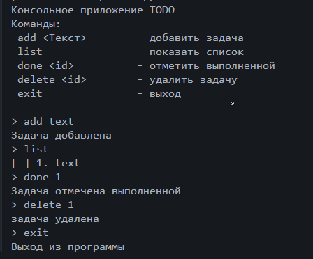

# Лабораторная работа №1. Быстрое погружение в язык Dart

## Описание 

Изучение основ языка **Dart**, путём сравнивания синтаксиса и концепции с ранее изученными языками **Kotlin** и **С#**, и создали консольное приложение **ToDo**.

## Скриншот приложения



## Как запустить

1. Скачать архив приложения с GitHub (https://github.com/MorOlesya/dart_todo-app.git)
2. Разархивировать в папку.
3. Открыть приложение
4. Ввести в консоль ```dart bin/todo_app.dart```
5. Пользоваться приложением

## Что изучили

* язык Dart
* синтаксис Dart
* разработка простых приложений на Dart

## Вопросы

1. Чем final отличается от const в Dart? 

В **final** не обязательно сразу задавать значение, в отличие от **const**, где значение необходимо задавать при создание.

2. Что означает String?

**String** - это строковый тип данных.

3. Чем Future отличается от обычного значения? Что означает await с точки зрения потока выполнения?

**Future<T>** — это объект, который сейчас не содержит результат, а получит его позже.

**await:**
• приостанавливает выполнение текущей функции
• не блокирует поток
• позволяет другим событиям выполняться

4. Зачем в Dart именованные конструкторы, если в C# есть перегрузка?

Именованные конструкторы позволяют создавать объекты разными способами, делая код более гибким.
